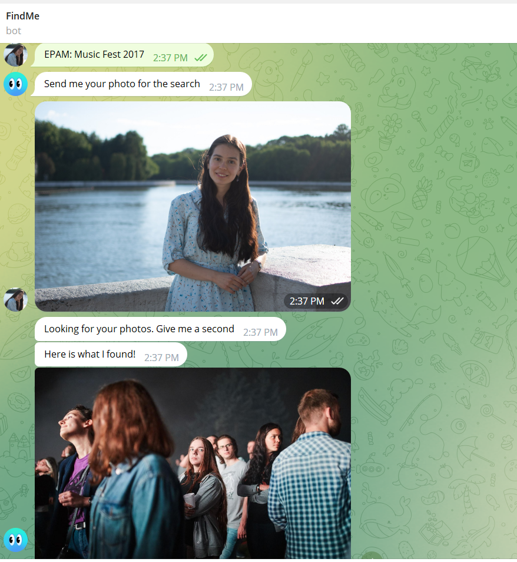

## Description

Telegram bot that allows you to search for the photos with you among large albums. You choose an album you would like to perform search in and then send a photo for the search. There should be only one person in a photo and a face should be clearly visible.

Bot will search for the photos and then send you the findings as an album. Implementation is based on [Insightface](https://github.com/deepinsight/insightface/tree/master/python-package), [Faiss](https://github.com/facebookresearch/faiss) for quick search in a vector space. Google Cloud SQL is used as a relational database storing data about registered users and chosen album. [PyTelegramBotAPI](https://pytba.readthedocs.io/en/latest/) is used for the implementation of Telegram-related logic.

## Deployment
Dockerfile is provided for the project, so it can be easily deployed to any platform that supports Docker(Google Cloud Run, Heroku, etc).
Several environment variables should be provided during deployment

| Variable name      | Description |
| ----------- | ----------- |
| BOT_TOKEN      | Telegram token used to identify the bot, should  be obtained via [BotFather](https://t.me/botfather)       |
| DB_USER   | Name of the user to access Cloud SQL        |
| INSTANCE_CONNECTION_NAME | Instance connection name for the Cloud SQL, can be found in GCP console |
|DB_PASS | Password for the Cloud SQL |
| DB_NAME | Name of the database in Cloud SQL |

Also you need to provide GCP credentials. It can be done by adding GOOGLE_APPLICATION_CREDENTIALS environment variable pointing to the json file with credentials, or you can perform authentification using gcloud.

## Docker build and run example

### Build an image

```
docker build -t findme-bot .
```

### Run container from the image

```
docker run -d -e BOT_TOKEN='{bot_token}' -e INSTANCE_CONNECTION_NAME='{projectId}:{region}:{instanceName}' -e DB_USER='{user}' -e DB_PASS='{password}' -e DB_NAME='{database}' -e GOOGLE_APPLICATION_CREDENTIALS={path_to_json_file} findme-bot
```

## Usage example

Here is a simple example of user-bot interaction. User has already chosen the album to search in (EPAM: Music Fest 2017) and sends the picture for the search

